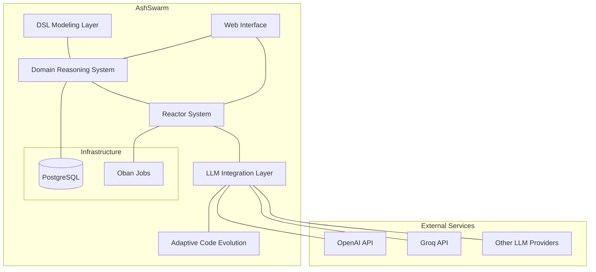
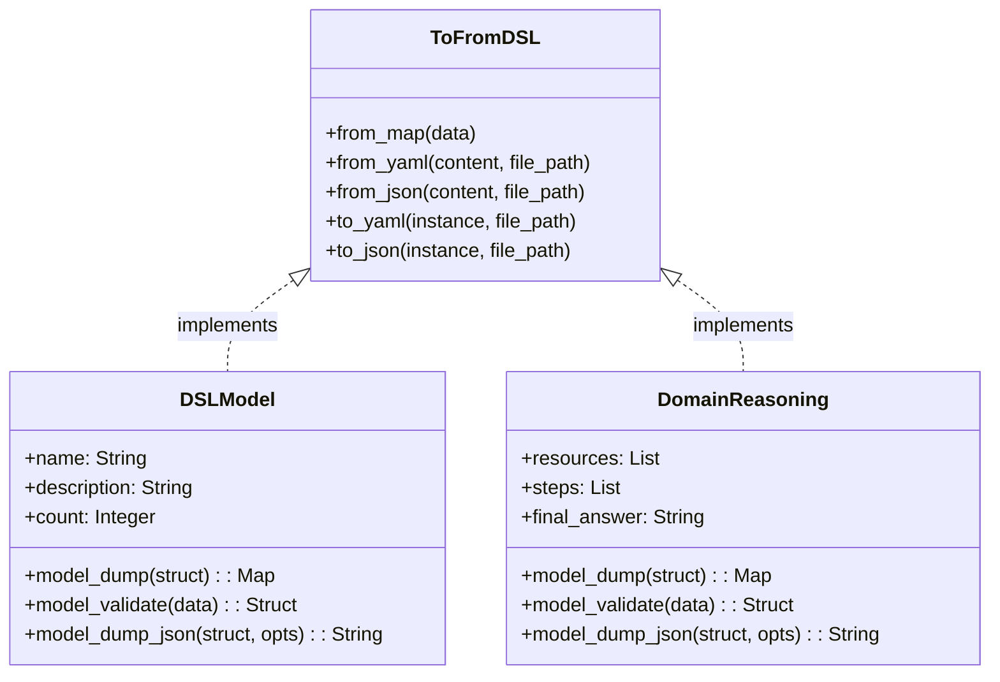
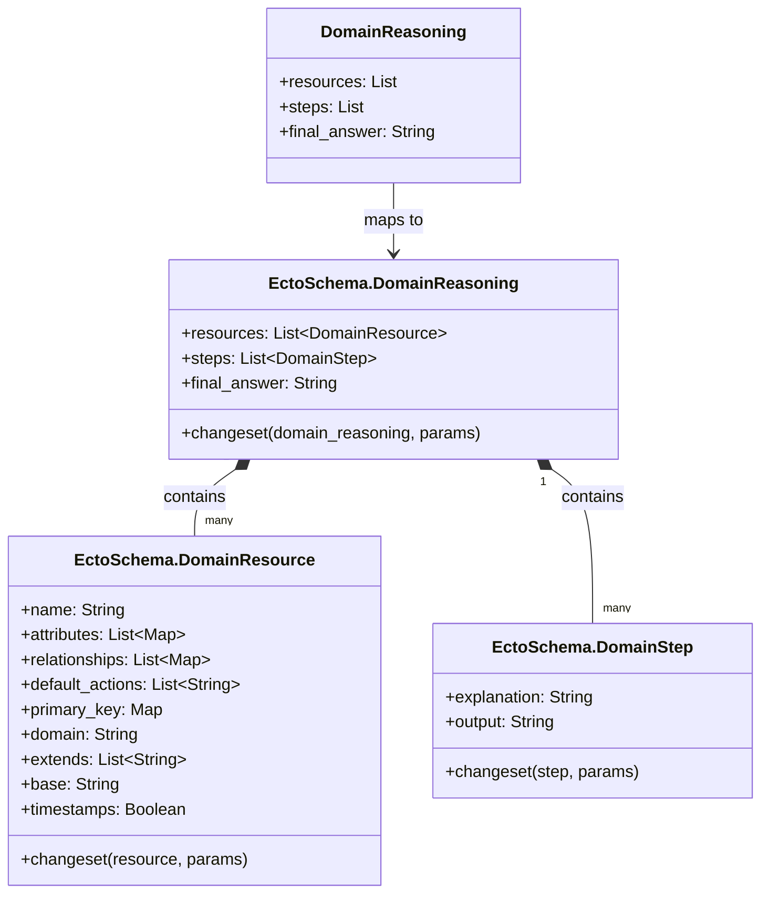
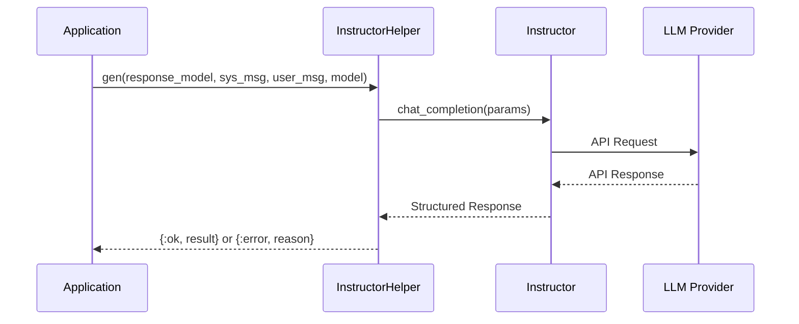
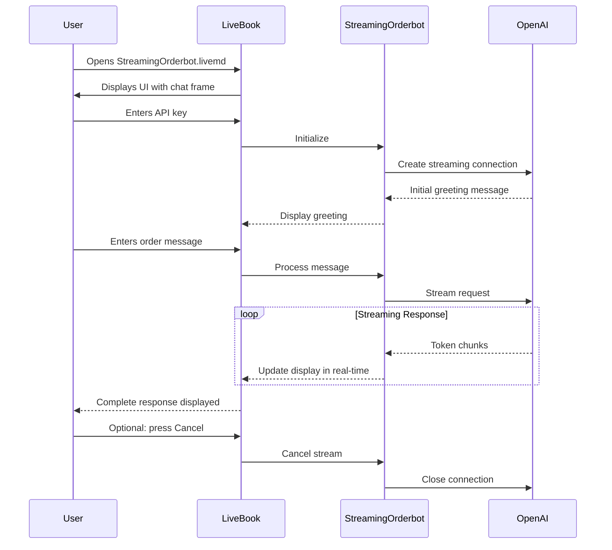
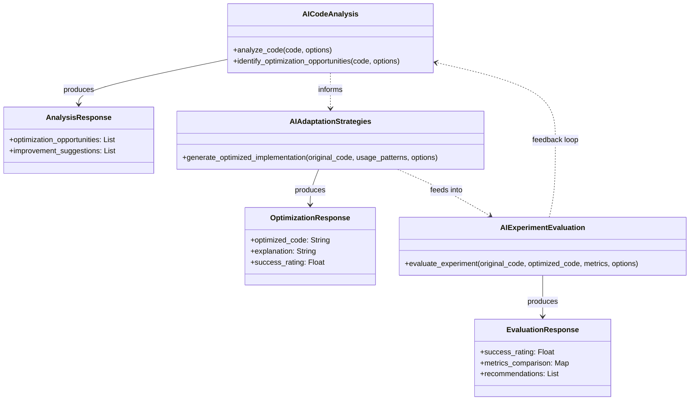

# AshSwarm Component Diagram

This document provides a visual representation of the AshSwarm system architecture. The diagrams are presented in text format using Mermaid markdown, which can be rendered in many Markdown viewers.

## System Overview Diagram



## DSL Modeling Components



## Domain Reasoning Components



## Reactor Components

```mermaid
graph TB
    subgraph "Reactor System"
        QASaga[QASaga]
        Question[Question Resource]
        QASagaJob[QASaga Oban Job]
        
        QASaga --> Question: uses
        QASagaJob --> QASaga: runs
    end
    
    subgraph "External Components"
        Oban((Oban))
        Instructor((Instructor))
        LLM((LLM Provider))
    end
    
    QASagaJob --- Oban: scheduled by
    Question --- Instructor: uses
    Instructor --- LLM: calls
```

## LLM Integration Flow



## Data Flow Diagram

```mermaid
graph LR
    Input[/Input Data/] --> DSL[DSL Parsing]
    DSL --> DomainModel[Domain Model]
    DomainModel --> Validation[AI Validation]
    Validation --> ReactorSystem[Reactor System]
    ReactorSystem --> LLM[LLM Queries]
    LLM --> Processing[Response Processing]
    Processing --> Output[/Output Data/]
    
    subgraph "Storage"
        DB[(PostgreSQL)]
    end
    
    DomainModel -.-> DB: persist
    ReactorSystem -.-> DB: persist jobs
```

## Deployment View

```mermaid
graph TB
    subgraph "Server"
        App[AshSwarm Application]
        Phoenix[Phoenix Web Server]
        PG[(PostgreSQL)]
        
        App --- Phoenix
        App --- PG
    end
    
    subgraph "Development"
        LiveBook[LiveBook Server]
    end
    
    subgraph "External Services"
        LLMProviders[LLM API Providers]
    end
    
    App --- LLMProviders
    LiveBook --- App: development only
    
    Browser[Web Browser] --- Phoenix
    Browser --- LiveBook
```

## Streaming OrderBot Interaction



## Adaptive Code Evolution Components



## Domain Reasoning Components

```mermaid
classDiagram
    class DomainReasoning {
        +resources: List
        +steps: List
        +final_answer: String
    }
    
    class EctoSchema.DomainReasoning {
        +resources: List~DomainResource~
        +steps: List~DomainStep~
        +final_answer: String
        +changeset(domain_reasoning, params)
    }
    
    class EctoSchema.DomainResource {
        +name: String
        +attributes: List~Map~
        +relationships: List~Map~
        +default_actions: List~String~
        +primary_key: Map
        +domain: String
        +extends: List~String~
        +base: String
        +timestamps: Boolean
        +changeset(resource, params)
    }
    
    class EctoSchema.DomainStep {
        +explanation: String
        +output: String
        +changeset(step, params)
    }
    
    DomainReasoning --> EctoSchema.DomainReasoning: maps to
    EctoSchema.DomainReasoning "1" *-- "many" EctoSchema.DomainResource: contains
    EctoSchema.DomainReasoning "1" *-- "many" EctoSchema.DomainStep: contains