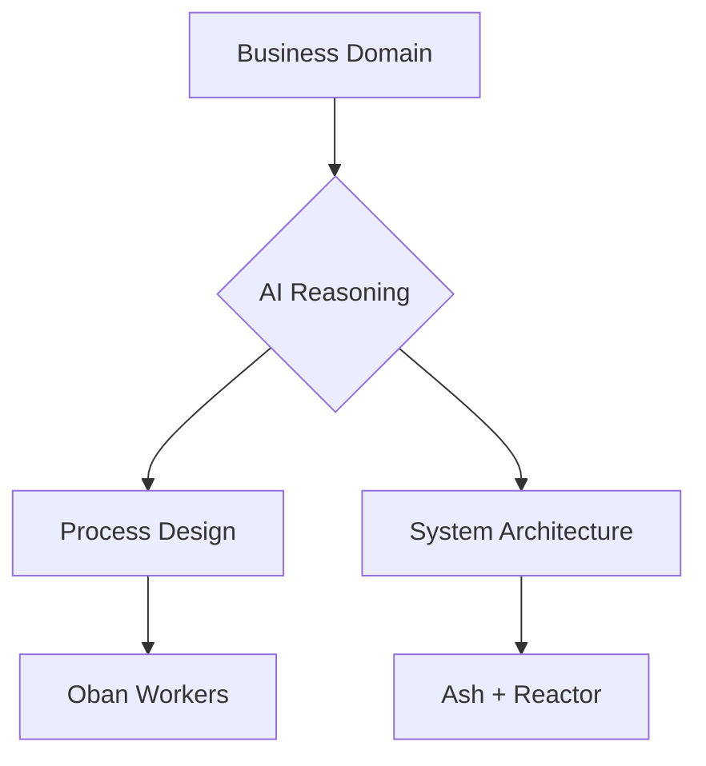

# EOD Update 3/3/25

Ash Swarm, Reactor, and AI-driven Business Solutions

<div class="pt-12">
  <span class="text-xl opacity-80">Building AI-native Business Solutions at Scale</span>
</div>

<!--
Quick intro and overview of the weekend's work
-->

---
layout: default
---

# Introduction

<v-clicks>

- Weekend focus: Ash Swarm, Reactor, and AI-driven solutions
- Core goal: Rapidly delivering AI-native business solutions
- Key components:
  - **Ash**: Resource management
  - **Reactor**: Workflow orchestration
  - **Automated Reasoning**: AI-driven system design
- Shifting enterprise AI solution delivery paradigm

</v-clicks>

<!--
Opening context and importance
-->

---
layout: default
---

# Solutions vs Applications

<div class="grid grid-cols-2 gap-4">
<div>
<v-clicks>

### Application Mindset
- Focuses on technology
- Feature-driven development
- Technical specifications
- "How do we build it?"

</v-clicks>
</div>

<div>
<v-clicks>

### Solution Mindset
- Focuses on business outcomes
- Value-driven development
- Business impact metrics
- "What problem are we solving?"

</v-clicks>
</div>
</div>

<div class="pt-8">
<v-clicks>

### Why This Matters
- Solutions directly address business needs
- Measurable ROI and value creation
- Faster time-to-value for stakeholders
- Better alignment with business strategy

</v-clicks>
</div>

---
layout: two-cols
---

# Debug Middleware & Observability

<v-clicks>

- Major breakthrough: Debug middleware
- Complete reactor execution visibility
- Step-by-step monitoring
- Enhanced debugging capabilities

</v-clicks>

::right::

```elixir
# Debug Middleware Output
[Debug] UserFlow starting
  ├─ Initialize User Context
  │  └─ Validating input
  ├─ Process Registration
  │  ├─ Create account
  │  └─ Send welcome email
  └─ Complete Registration
```

<!--
Real example of debug output
-->

---
layout: default
---

# Automating Reactor Workflows

<div class="grid grid-cols-2 gap-4">

<div>
<v-clicks>

- CLI-powered code generation
- Instant Ash resource creation
- Automated reactor generation
- Weeks → Seconds development

</v-clicks>
</div>

<div>
```bash
# CLI Demo
$ mix reactor.gen.reactor MyApp.CheckoutReactor \
    --input email:string \
    --input password:string \
    --step register_user:MyApp.RegisterUserStep \
    --step create_stripe_customer:MyApp.CreateStripeCustomerStep \
    --return register_user

Generating Step module: Elixir.MyApp.RegisterUserStep
Generating Step module: Elixir.MyApp.CreateStripeCustomerStep
```
</div>

</div>

---
layout: two-cols
---

# AI-Driven Reasoning

<v-clicks>

- Beyond chatbots
- Business process automation
- Domain-driven design
- Workflow orchestration
- Oban integration for scale

</v-clicks>

::right::



---
layout: default
---

# The Bigger Picture

<div class="grid grid-cols-2 gap-4">
<div class="pr-4">
<v-clicks>

- AI-native solutions at scale
- Dynamic system generation
- Automated maintenance
- Comparison with:
  - AWS Step Functions
  - LangChain
  - Jito

</v-clicks>
</div>

<div>
<v-clicks>

### Business Impact
- Elixir ecosystem power
- Enterprise-grade scalability
- Real-time business operations
- Production-ready solutions

</v-clicks>
</div>

</div>

---
layout: default
---

# Next Steps

<v-clicks>

- Polish CLI tooling
- Enhance AI reasoning
- Scale testing
- Documentation
- Community building

</v-clicks>

<div class="pt-12">
  <span class="px-2 py-1 rounded cursor-pointer" hover="bg-white bg-opacity-10">
    Interested in LLM-native solutions or scalable AI? Let's connect! 🚀
  </span>
</div>