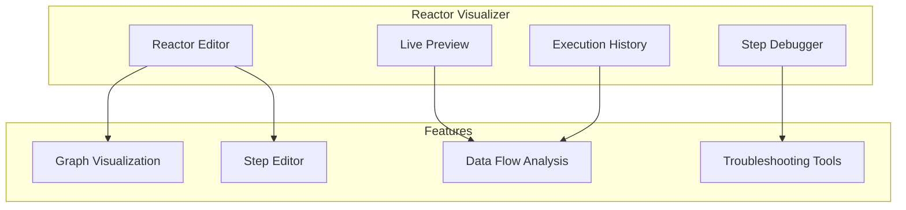
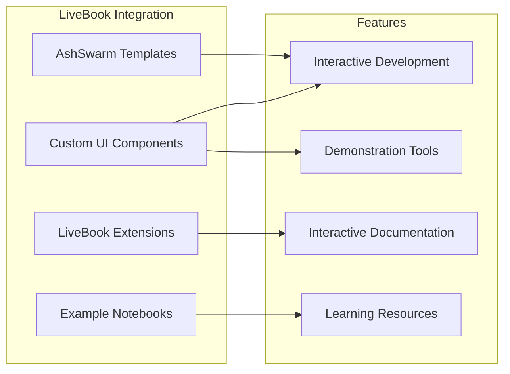
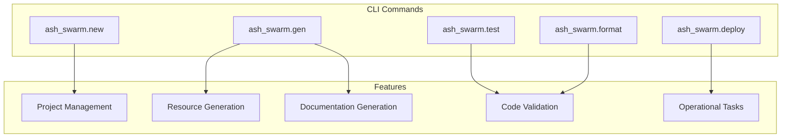
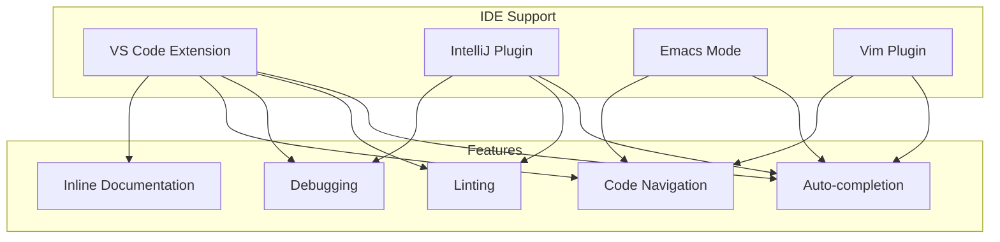
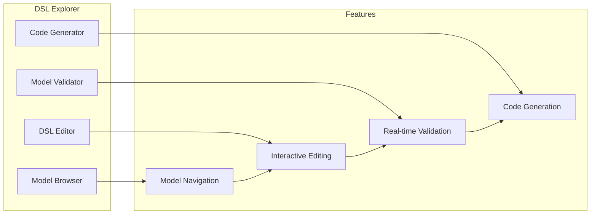
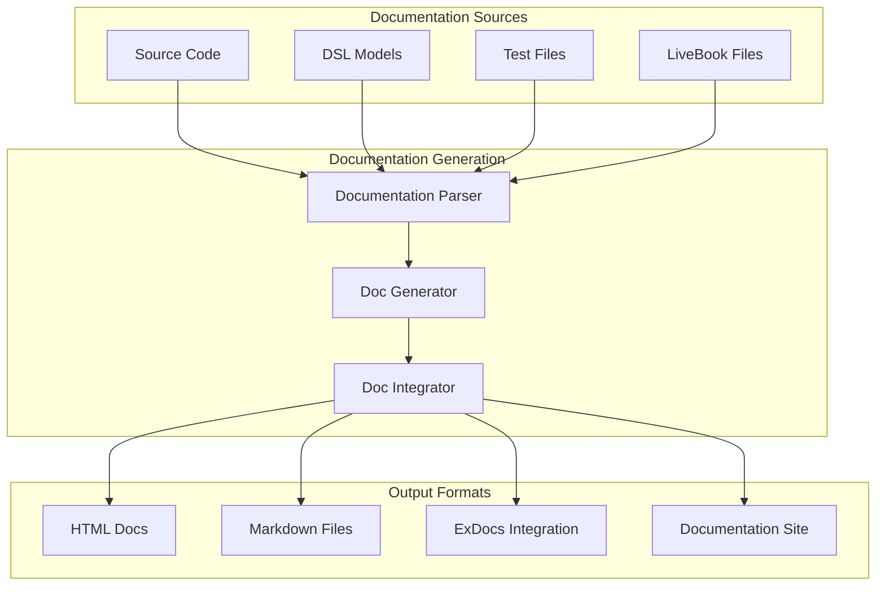
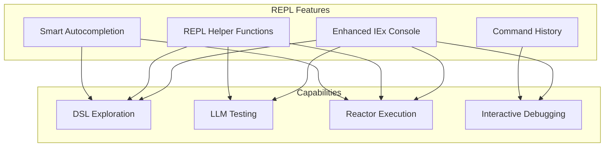
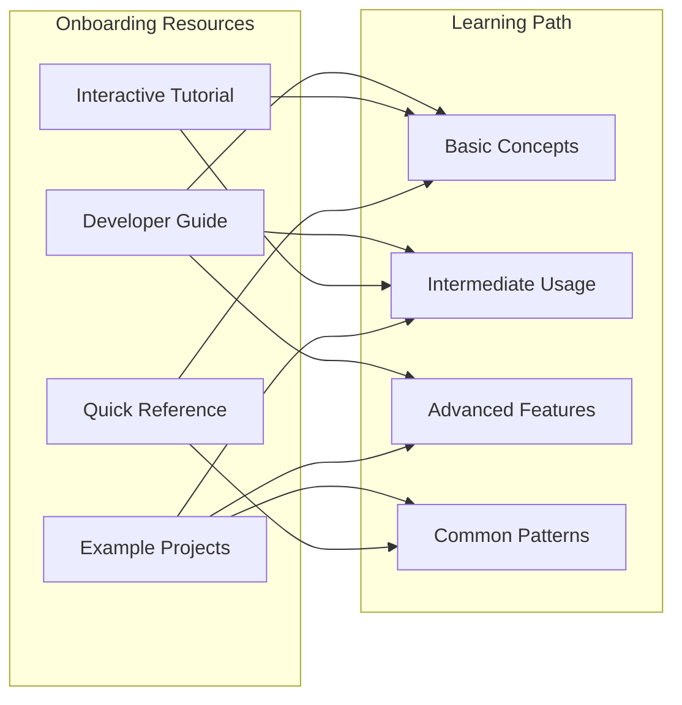

# Developer Experience

This document outlines planned improvements to the developer experience when working with AshSwarm, making development more productive, intuitive, and enjoyable.

## Interactive Development Tools

### Reactor Visualizer

The Reactor Visualizer will provide a graphical interface for viewing, creating, and debugging Ash Reactors.

#### Implementation Plan

1. **Graphical Reactor Builder**
   - Drag-and-drop interface for reactor steps
   - Visual flow connections between steps
   - Inline editing of step configurations
   - Template library for common patterns

2. **Live Preview & Testing**
   - Real-time preview of reactor definitions
   - Integrated testing interface
   - Input simulation and validation
   - Result visualization

3. **Reactor Debugging**
   - Step-by-step execution mode
   - Breakpoint support
   - Variable inspection
   - Step execution timing

4. **Execution History**
   - Historical execution tracking
   - Performance analysis
   - Error pattern detection
   - Success/failure statistics

### Enhanced LiveBook Integration

AshSwarm will provide deeper integration with LiveBook, making it a first-class environment for development and experimentation.

#### Implementation Plan

1. **AshSwarm LiveBook Templates**
   - Project starter templates
   - Common workflow templates
   - Debugging templates
   - Performance analysis templates

2. **Custom LiveBook Components**
   - Reactor flow visualization
   - LLM interaction components
   - Domain model editors
   - Performance monitoring dashboards

3. **LiveBook Extensions**
   - Syntax highlighting for AshSwarm DSLs
   - Smart autocompletion
   - Documentation integration
   - Linting and validation

4. **Comprehensive Example Notebooks**
   - Tutorial notebooks
   - Reference implementations
   - Debugging guides
   - Performance optimization guides

## Command Line Tools

AshSwarm will include a comprehensive command-line interface (CLI) for managing projects, resources, and development tasks.

#### Implementation Plan

1. **Project Scaffolding**
   - New project generation
   - Resource scaffolding
   - Reactor scaffolding
   - Test scaffolding

2. **Code Generation Tools**
   - Generate Ash resources from DSL models
   - Generate migration files
   - Create LiveBooks from templates
   - Scaffold test files

3. **Development Utilities**
   - Validation of DSL models
   - Lint and format code
   - Generate documentation
   - Run targeted tests

4. **Operational Commands**
   - Deployment management
   - Environment configuration
   - Monitoring and metrics
   - Backup and restore

## Integrated Development Environment Support

AshSwarm will provide integrations and extensions for popular development environments to streamline the development workflow.

#### Implementation Plan

1. **VS Code Extension**
   - Syntax highlighting for DSL models
   - Snippets for common patterns
   - Inline documentation
   - Integration with language server
   - Debugging support

2. **IntelliJ Platform Plugin**
   - Code completion
   - Navigation and references
   - Refactoring support
   - Run configurations

3. **Language Server Protocol Support**
   - Diagnostic messages
   - Code completion
   - Go to definition
   - Find references
   - Documentation on hover

4. **Editor-Agnostic Features**
   - Project templates
   - Code snippets
   - Documentation integration
   - Linting rules

## DSL Explorer & Editor

The DSL Explorer will provide tools for interactively exploring, creating, and validating DSL models.

#### Implementation Plan

1. **Model Browser**
   - Visual browsing of DSL models
   - Search and filter capabilities
   - Model relationships visualization
   - Version comparison

2. **Interactive DSL Editor**
   - Syntax-aware editing
   - Real-time validation
   - Inline documentation
   - Template library

3. **Model Validation**
   - Schema validation
   - Consistency checks
   - Best practice validation
   - Performance impact analysis

4. **Code Generation**
   - Generate Elixir code from DSL models
   - Customizable templates
   - Integration with existing code
   - Documentation generation

## Documentation Generation

AshSwarm will provide tools for automatically generating comprehensive documentation from code and DSL models.

#### Implementation Plan

1. **Code Documentation Extraction**
   - Extract documentation from source code
   - Parse DSL models for structure
   - Generate API reference documentation
   - Create relationship diagrams

2. **Interactive Documentation**
   - LiveBook-integrated documentation
   - Runnable examples
   - Interactive diagrams
   - Search and navigation

3. **Documentation Website Generator**
   - Static site generation
   - Versioned documentation
   - Search functionality
   - Mobile-friendly design

4. **Documentation Testing**
   - Verify documentation examples
   - Check for documentation coverage
   - Validate links and references
   - Readability scoring

## REPL Enhancements

AshSwarm will provide enhanced REPL capabilities for interactive development and debugging.

#### Implementation Plan

1. **Enhanced IEx Console**
   - Custom AshSwarm IEx configuration
   - Improved formatting for AshSwarm types
   - Helper aliases and imports
   - Color-coded output

2. **REPL Helper Functions**
   - DSL model inspection
   - Reactor execution helpers
   - LLM interaction testing
   - Performance profiling

3. **Interactive Debugging**
   - Step-by-step reactor execution
   - LLM call inspection
   - State inspection and modification
   - Timing analysis

4. **Development Workflow Integration**
   - Test execution from REPL
   - Documentation access
   - Code reloading
   - Configuration management

## Developer Onboarding Tools

AshSwarm will include tools and resources to help new developers get up to speed quickly.

#### Implementation Plan

1. **Interactive Tutorials**
   - Self-guided tutorial series
   - LiveBook-based interactive learning
   - Progressively complex examples
   - Hands-on exercises

2. **Example Project Library**
   - Real-world example applications
   - Common use case implementations
   - Best practice demonstrations
   - Performance optimization examples

3. **Quick Start Templates**
   - Project templates for common use cases
   - Starter kits with documentation
   - Configuration templates
   - Docker-based development environments

4. **Developer Community**
   - Q&A forums
   - Knowledge base
   - Code snippet sharing
   - Best practice discussions 