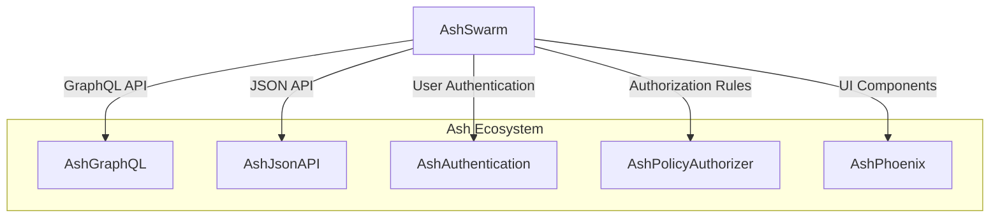
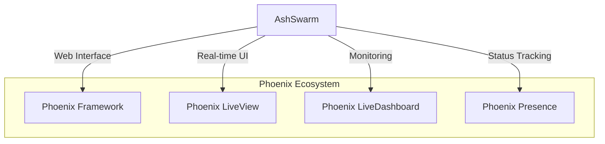
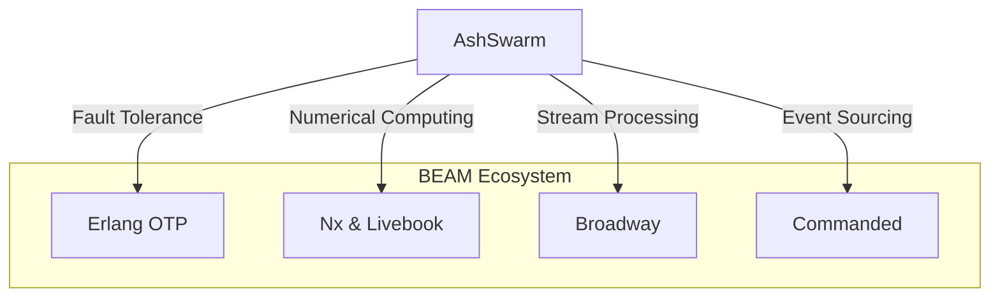
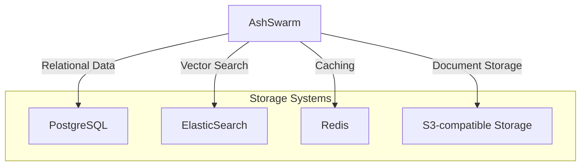
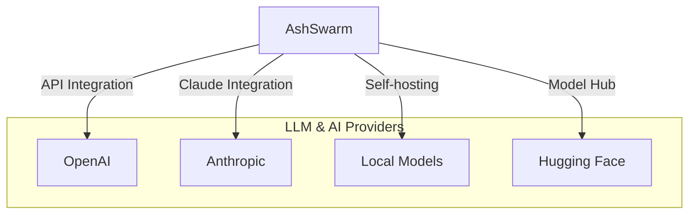
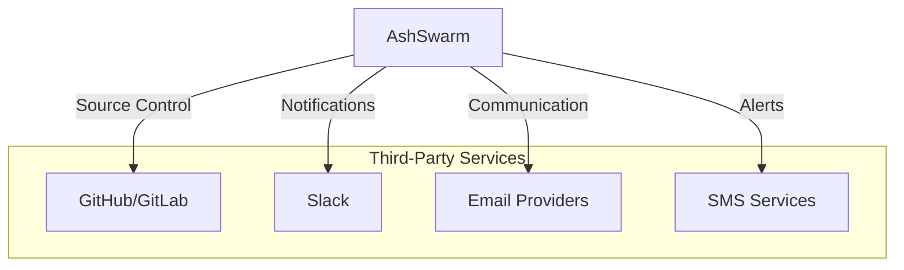
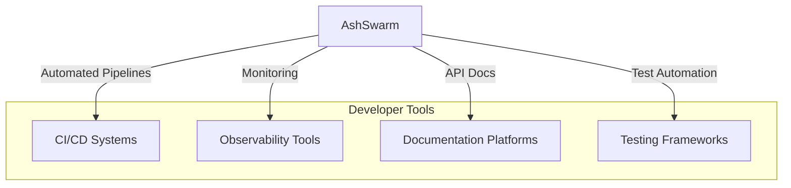
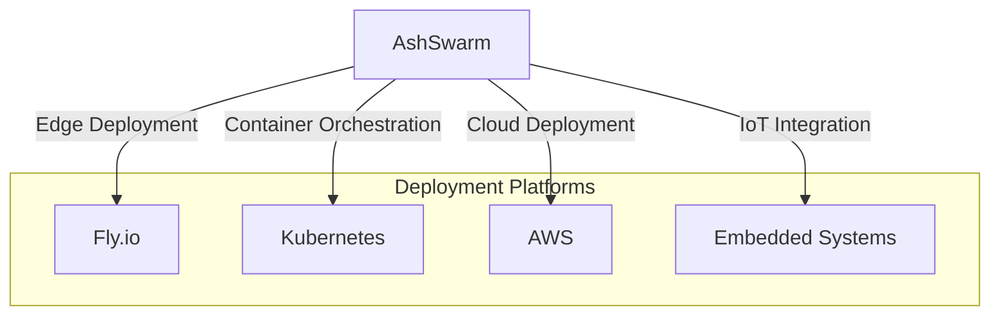

# Ecosystem Integration

This document outlines how AshSwarm will evolve to integrate with the broader Elixir/Phoenix ecosystem and external systems.

## Ash Framework Integrations

AshSwarm will continue to deepen its integration with other Ash Framework components.

### Implementation Plan

1. **AshGraphQL Integration**
   - Add swarm-specific GraphQL types
   - Define reactor mutation capabilities
   - Implement subscription support for reactor events
   - Create custom GraphQL directives for LLM interactions

2. **AshJsonAPI Integration**
   - Define JSON:API resources for swarm components
   - Implement custom relationship handling for reactors
   - Create standardized error formats
   - Support streaming responses for LLM interactions

3. **AshAuthentication Integration**
   - Role-based access to swarm capabilities
   - User-specific swarm configurations
   - Authentication for LLM provider APIs
   - Audit logging for swarm operations

4. **AshPolicyAuthorizer Integration**
   - Granular permissions for reactor execution
   - Resource-level access policies
   - Data filtering based on authorization context
   - Cost control policies for LLM usage

5. **AshPhoenix Integration**
   - LiveView components for reactor management
   - Form helpers for swarm configuration
   - Real-time updates for reactor execution
   - Interactive visualization components

## Phoenix Ecosystem Integration

AshSwarm will provide seamless integration with Phoenix Framework and its ecosystem.

### Implementation Plan

1. **Phoenix Framework Integration**
   - Custom controllers for swarm management
   - Request/response plugs for LLM interactions
   - Telemetry integration
   - Session management for swarm context

2. **Phoenix LiveView Integration**
   - Real-time reactor monitoring
   - Interactive swarm configurators
   - Live updates for LLM interactions
   - Streaming response rendering

3. **Phoenix LiveDashboard Integration**
   - Custom pages for swarm metrics
   - Reactor execution visualizations
   - LLM usage dashboards
   - Performance monitoring panels

4. **Phoenix Presence Integration**
   - Track active swarm participants
   - Monitor reactor execution status
   - Coordinate distributed swarm operations
   - Real-time collaboration support

## BEAM Ecosystem Integration

AshSwarm will leverage the strengths of the broader BEAM ecosystem.

### Implementation Plan

1. **OTP Integration**
   - Leverage supervision trees for fault tolerance
   - Use GenServers for stateful swarm components
   - Implement Registry for swarm component discovery
   - Utilize ETS for high-performance caching
   - Support distributed swarm operations

2. **Nx & Livebook Integration**
   - Utilize Nx for tensor operations in LLM processing
   - Integrate with EXLA for accelerated computation
   - Create Kino components for LiveBook integration
   - Support local embedding model execution

3. **Broadway Integration**
   - Scalable processing of LLM interactions
   - Batch optimization for cost efficiency
   - Rate limiting and backpressure handling
   - Integration with various messaging systems

4. **Commanded Integration**
   - Event sourcing for swarm operations
   - CQRS patterns for swarm state management
   - Process manager for long-running swarm operations
   - Event-driven reactor execution

## Database & Storage Integration

AshSwarm will provide integration with various data storage systems.

### Implementation Plan

1. **PostgreSQL Extensions**
   - pgvector integration for embedding storage
   - JSON operations for flexible data storage
   - Specialized indexes for swarm operations
   - Full-text search capabilities

2. **ElasticSearch Integration**
   - Vector search for semantic similarity
   - Advanced text analysis for NLP tasks
   - Aggregation capabilities for analytics
   - Document enrichment pipelines

3. **Redis Integration**
   - Caching of LLM responses
   - Rate limiting for API calls
   - Pub/Sub for real-time updates
   - Distributed locks for coordination

4. **S3-compatible Storage**
   - Document storage and retrieval
   - LLM context archive
   - Training data management
   - Backup and restore capabilities

## LLM Provider Ecosystem

AshSwarm will integrate with a wide variety of LLM providers and AI services.

### Implementation Plan

1. **Multi-Provider Support**
   - Unified API for multiple LLM providers
   - Provider-specific optimizations
   - Automatic fallback between providers
   - Cost optimization strategies

2. **Local Model Integration**
   - Support for running open-source models locally
   - Integration with GGML and ONNX formats
   - Quantization options for resource efficiency
   - Fine-tuning capabilities for domain adaptation

3. **Specialized AI Services**
   - Image generation and analysis
   - Audio transcription and synthesis
   - Document OCR and parsing
   - Video analysis capabilities

4. **Model Management**
   - Model versioning and tracking
   - A/B testing infrastructure
   - Performance benchmarking
   - Deployment management

## Third-Party Service Integration

AshSwarm will provide integrations with various third-party services.

### Implementation Plan

1. **Version Control Integration**
   - GitHub/GitLab API integration
   - Automatic PR generation and review
   - Issue tracking integration
   - CI/CD pipeline integration

2. **Communication Platforms**
   - Slack app integration
   - Microsoft Teams integration
   - Discord bot capabilities
   - Webhook support for custom integrations

3. **Notification Services**
   - Email service integration
   - SMS notification capabilities
   - Push notification support
   - Customizable notification templates

4. **Data Services**
   - Integration with external data sources
   - API gateway capabilities
   - Data transformation pipelines
   - Webhook handling for external events

## Developer Tooling Ecosystem

AshSwarm will integrate with developer tools to streamline the development process.

### Implementation Plan

1. **CI/CD Integration**
   - GitHub Actions workflows
   - GitLab CI pipelines
   - Docker-based deployment
   - Release automation

2. **Observability Integration**
   - Prometheus metrics export
   - Grafana dashboard templates
   - OpenTelemetry instrumentation
   - Logging integration with common platforms

3. **Documentation Integration**
   - ExDoc integration
   - OpenAPI specification generation
   - Interactive API documentation
   - Automatic diagram generation

4. **Testing Integration**
   - Integration with ExUnit and PropCheck
   - API testing utilities
   - Performance testing tools
   - Mock LLM providers for testing

## Cross-Platform Deployment

AshSwarm will support deployment on various platforms and environments.

### Implementation Plan

1. **Cloud Platform Deployment**
   - AWS integration (Lambda, ECS, EC2)
   - Google Cloud Platform support
   - Azure deployment templates
   - Digital Ocean compatibility

2. **Container Orchestration**
   - Kubernetes deployment manifests
   - Helm charts for easy deployment
   - Docker Compose configurations
   - Resource optimization for containerized deployment

3. **Edge Computing Support**
   - Fly.io deployment templates
   - Cloudflare Workers integration
   - Vercel/Netlify deployment options
   - Edge function optimizations

4. **Embedded System Support**
   - Nerves integration for IoT devices
   - Resource-efficient operation modes
   - Offline LLM capability
   - Synchronization mechanisms for intermittent connectivity 