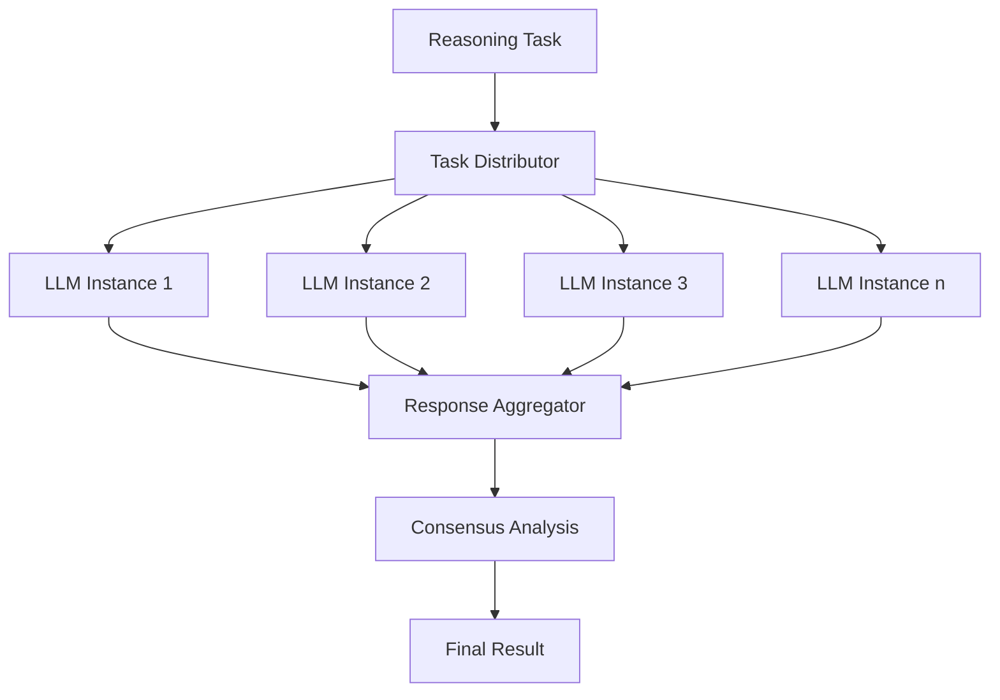
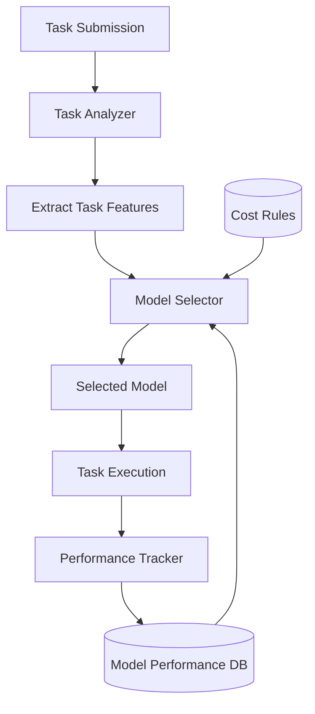
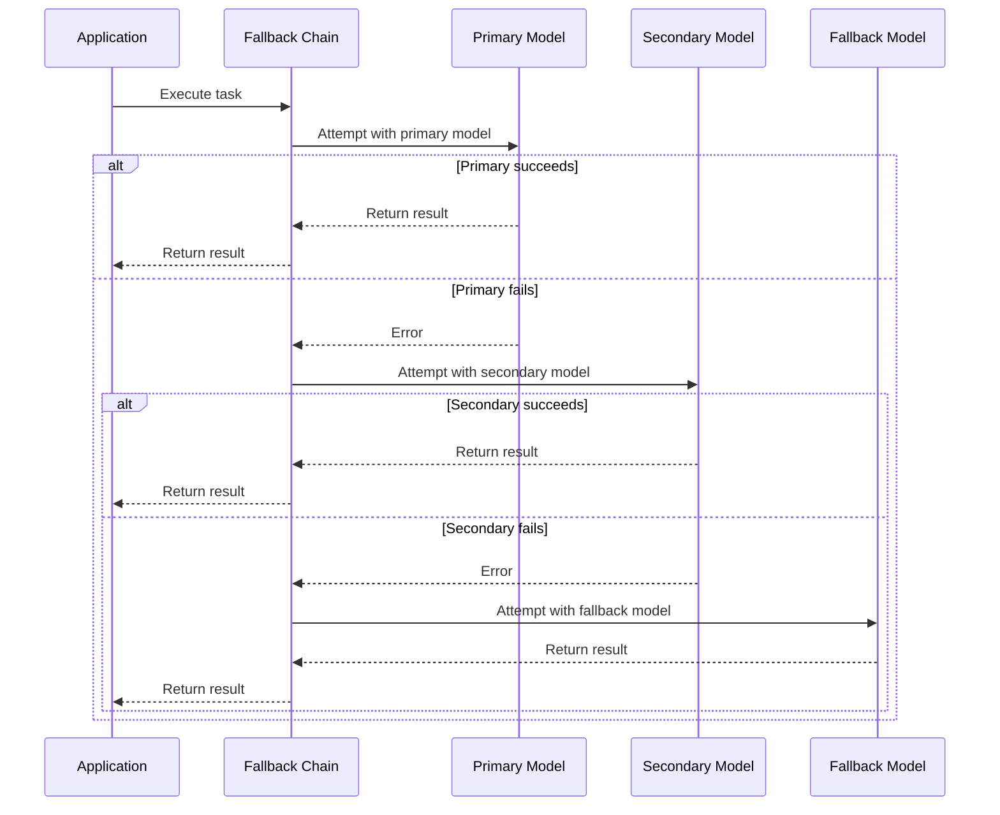
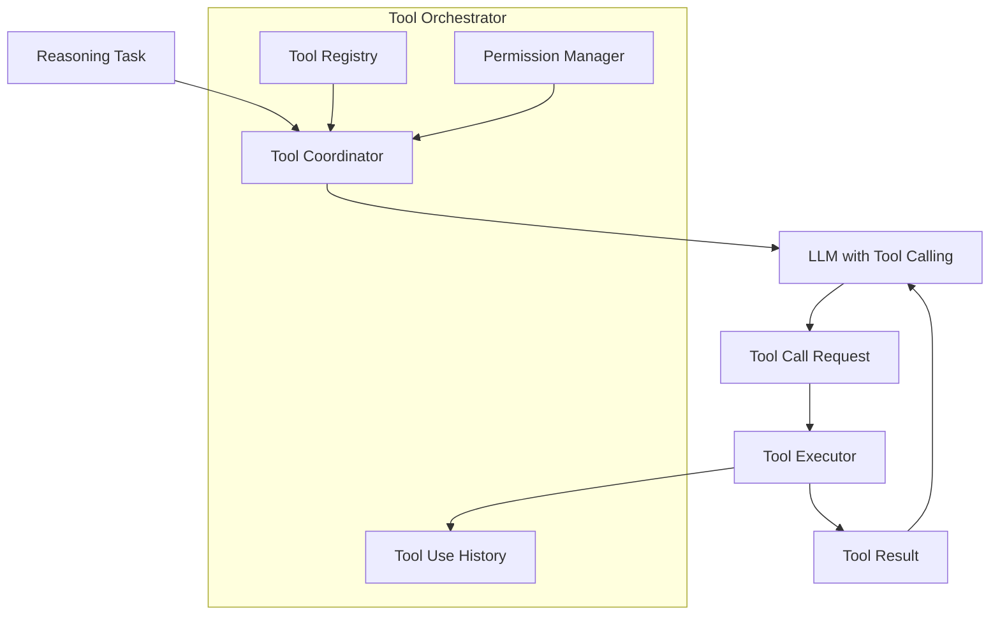
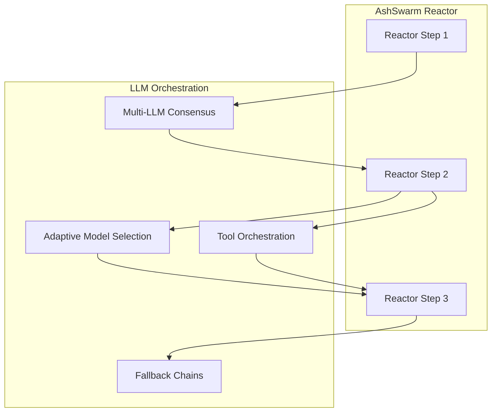

# Enhanced LLM Orchestration

This document details the planned enhancements to AshSwarm's LLM orchestration capabilities, moving from single-LLM calls to sophisticated multi-LLM coordination.

## Swarm Intelligence: Multi-LLM Consensus

### Overview

The Multi-LLM Consensus system will enable multiple LLMs to collaborate on complex reasoning tasks. Rather than relying on a single model's output, AshSwarm will coordinate multiple models to achieve more reliable and balanced results.

### Implementation Plan

1. **Parallel Execution Framework**
   - Create a coordinator module that can distribute the same task to multiple LLMs
   - Implement asynchronous execution using Task for parallel processing
   - Integrate timeouts and failure handling

2. **Response Aggregation Strategies**
   - Majority voting for categorical decisions
   - Statistical aggregation for numerical estimates
   - Semantic similarity clustering for text responses
   - Custom aggregation logic for domain-specific tasks

3. **Confidence Scoring**
   - Develop a system to assess model confidence in responses
   - Weight model inputs based on confidence scores
   - Flag low-consensus items for human review

4. **Model Diversity Management**
   - Ensure diverse model selection (different architectures, training data)
   - Balance between model quality and resource consumption
   - Automatically adjust the number of models based on task complexity

## Adaptive Model Selection

### Overview

The Adaptive Model Selection system will intelligently choose the most appropriate LLM for a given task based on performance history, cost considerations, and task characteristics.

### Implementation Plan

1. **Task Characterization**
   - Develop metrics for task complexity
   - Classify tasks by category (creative, analytical, factual)
   - Extract key task features (token count, domain, etc.)

2. **Model Performance Tracking**
   - Record historical performance of models by task type
   - Track latency, cost, and quality metrics
   - Implement progressive learning to improve selection over time

3. **Selection Algorithm**
   - Create a scoring function that balances quality, cost, and latency
   - Implement configurable selection policies
   - Provide manual override capabilities for specific use cases

4. **Cost Management**
   - Implement budget-aware selection logic
   - Create cost forecasting for model selection
   - Automate cost optimization based on usage patterns

## Fallback Chains

### Overview

Fallback Chains will enable graceful degradation of service by automatically trying alternative models when a preferred model fails or is unavailable.

### Implementation Plan

1. **Chain Configuration**
   - Define a configuration format for model chains
   - Support conditional fallback logic
   - Allow for response transformation between chain links

2. **Failure Detection**
   - Classify different types of failures (timeout, API error, content policy)
   - Implement custom retry policies by failure type
   - Add observability for chain execution paths

3. **Result Normalization**
   - Create adapter layers to normalize responses across different models
   - Implement quality checks for fallback results
   - Add metadata about which model in the chain produced the result

4. **Dynamic Chain Adjustment**
   - Monitor success rates across the chain
   - Automatically reorder chain links based on reliability
   - Implement circuit breakers for consistently failing models

## Tool Use Orchestration

### Overview

Tool Use Orchestration will enable coordinated use of tools across multiple LLM interactions, allowing for complex multi-step processes with tool-augmented LLMs.

### Implementation Plan

1. **Tool Registry**
   - Create a registry for available tools
   - Implement schema validation for tool inputs/outputs
   - Add capability documentation for LLM context

2. **Permission Management**
   - Implement granular permissions for tool access
   - Create security policies for sensitive operations
   - Add audit logging for tool usage

3. **Context Management**
   - Track tool usage across conversation turns
   - Maintain state for multi-step operations
   - Implement context windowing for long interactions

4. **LLM-Specific Adaptations**
   - Create adapter layers for different LLM tool calling formats
   - Optimize tool descriptions for different models
   - Implement model-specific error handling

## Integration with Reactor System

### Overview

The enhanced LLM orchestration capabilities will be integrated with AshSwarm's Reactor system, allowing reactors to leverage sophisticated LLM collaboration patterns.

### Implementation Plan

1. **Reactor Middleware**
   - Create middleware for integrating LLM orchestration into reactors
   - Implement configuration options for orchestration behavior
   - Add telemetry for orchestration performance

2. **Declarative Orchestration Definition**
   - Extend reactor DSL to include orchestration configuration
   - Support conditional orchestration strategies
   - Allow for dynamic strategy selection

3. **Reactor-Aware Orchestration**
   - Make orchestration context-aware of reactor state
   - Implement reactor-specific optimization strategies
   - Add reactor cycle detection for recursive LLM calls 