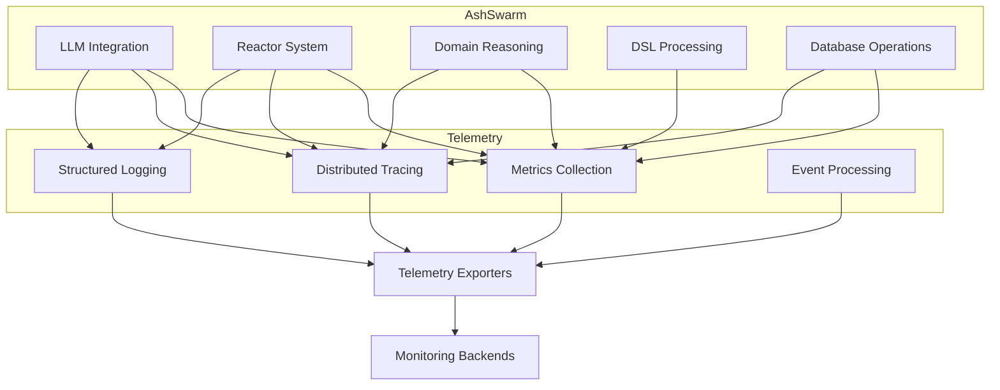
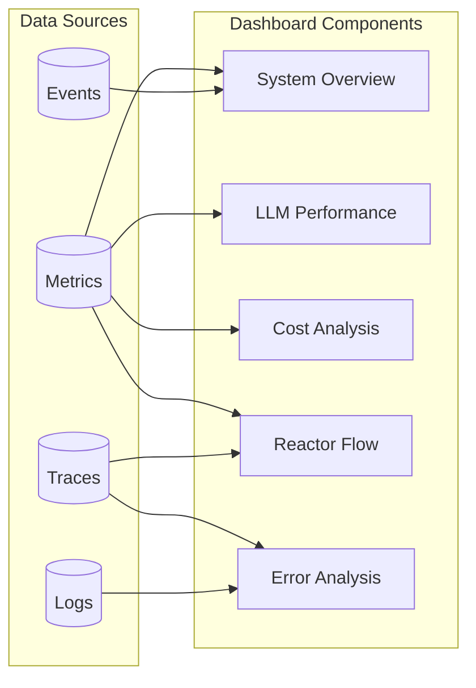
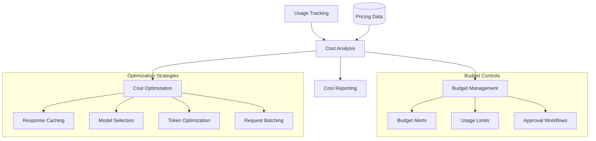
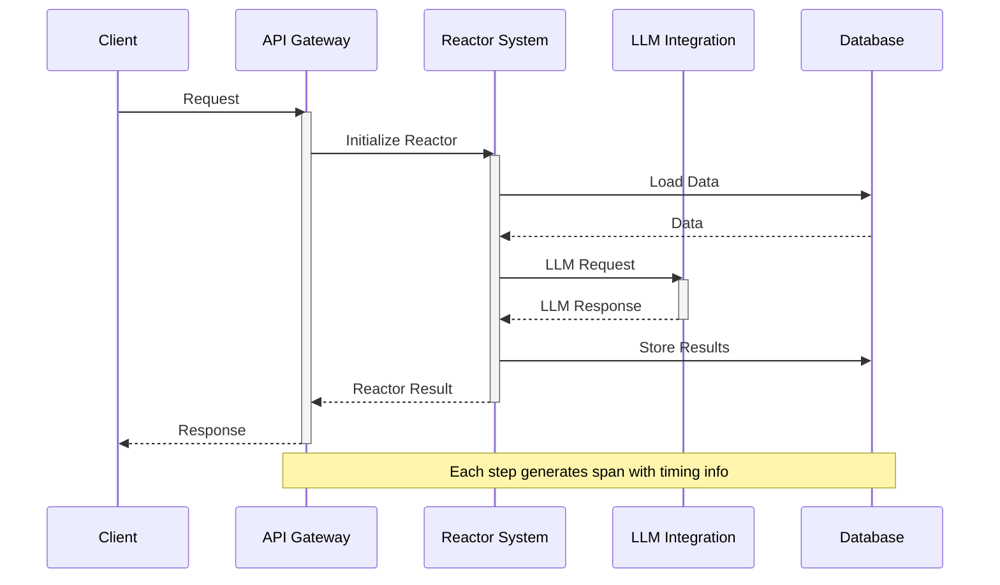
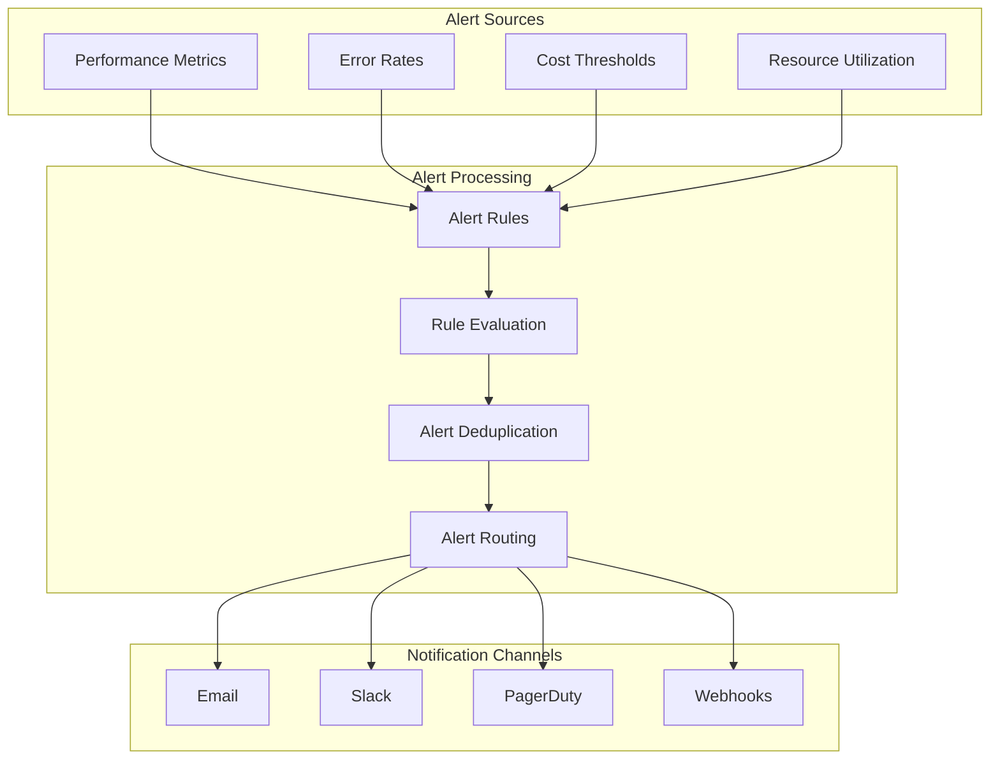
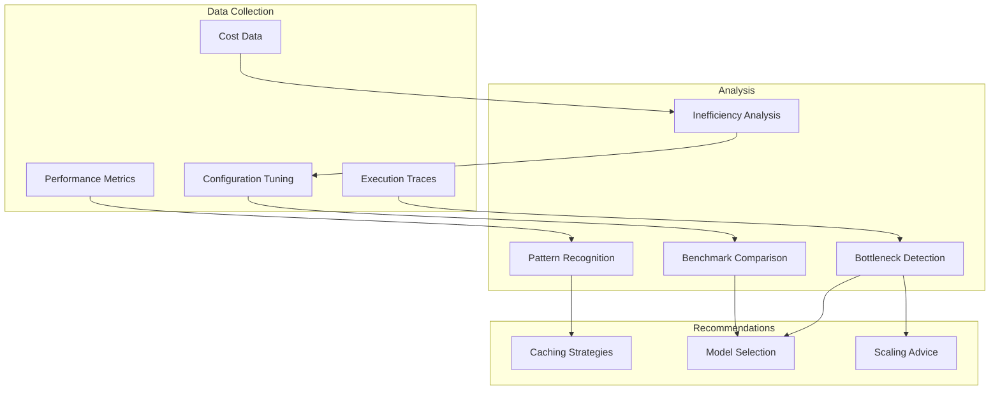

# Performance & Monitoring

This document outlines the planned performance monitoring and telemetry features for AshSwarm, enabling comprehensive tracking, analysis, and optimization of system behavior.

## Telemetry Integration

### Overview

AshSwarm will implement comprehensive telemetry using OpenTelemetry to provide visibility into every aspect of operation, from LLM calls to reactor execution and database interactions.

### Implementation Plan

1. **Core Instrumentation**
   - Integrate `:telemetry` handlers for key functions and modules
   - Implement OpenTelemetry trace context propagation
   - Add standardized metric naming conventions
   - Create structured logging with correlation IDs

2. **LLM Call Tracking**
   - Track LLM API calls with detailed timing information
   - Record token usage, costs, and model information
   - Capture prompt and response statistics
   - Monitor rate limits and quotas

3. **Reactor Performance Metrics**
   - Measure reactor execution time by step
   - Track reactor success/failure rates
   - Monitor concurrent reactor execution
   - Gather statistics on reactor data flow

4. **DSL Operation Metrics**
   - Measure serialization/deserialization performance
   - Track DSL model validation times
   - Monitor DSL model sizes and complexity
   - Gather usage statistics by DSL type

5. **Integration with Monitoring Systems**
   - Prometheus integration for metrics
   - Jaeger/Zipkin integration for traces
   - ELK/Loki integration for logs
   - Custom dashboards for AshSwarm-specific metrics

## Dashboard & Visualization

### Overview

A dedicated performance dashboard will provide intuitive visualizations of system metrics, enabling operators to quickly identify bottlenecks, monitor costs, and optimize performance.

### Implementation Plan

1. **System Overview Dashboard**
   - High-level health indicators
   - Key performance indicators
   - Resource utilization metrics
   - Throughput and latency graphs

2. **LLM Performance Panels**
   - Model-specific performance metrics
   - Response time distributions
   - Token usage tracking
   - Rate limit monitoring

3. **Cost Analysis Tools**
   - Real-time cost tracking
   - Historical cost analysis
   - Budget monitoring
   - Cost optimization recommendations

4. **Reactor Flow Visualization**
   - Visual reactor execution graphs
   - Step timing analysis
   - Bottleneck identification
   - Concurrency visualization

5. **Error Analysis Interface**
   - Error rate tracking
   - Common failure modes
   - Error correlation analysis
   - Troubleshooting guides

## Cost Management

### Overview

The cost management system will provide comprehensive tools for tracking, analyzing, and optimizing the costs associated with LLM API usage.

### Implementation Plan

1. **Usage Tracking**
   - Per-request token counting
   - Model-specific pricing calculations
   - Usage aggregation by time period
   - Usage attribution by component/feature

2. **Budget Management**
   - Budget definition by time period
   - Alert thresholds configuration
   - Hard and soft spending limits
   - Budget approval workflows

3. **Cost Reporting**
   - Real-time cost dashboards
   - Historical trend analysis
   - Cost forecasting
   - Export capabilities for accounting

4. **Optimization Recommendations**
   - Automated detection of inefficient patterns
   - Token usage optimization suggestions
   - Model selection recommendations
   - Caching opportunity identification

## Request Tracing

### Overview

Request tracing will provide end-to-end visibility into the processing of requests through AshSwarm, from initial API calls to final responses.

### Implementation Plan

1. **Trace Context Propagation**
   - Implement trace context propagation across process boundaries
   - Ensure trace IDs flow through async operations
   - Maintain trace context in Oban jobs
   - Create custom context for LLM API calls

2. **Span Generation**
   - Create spans for key operations with timing info
   - Add relevant attributes to spans for filtering
   - Implement nested spans for hierarchical operations
   - Add semantic conventions for AshSwarm-specific concepts

3. **Error Tracking**
   - Annotate spans with error information
   - Create error-specific spans for detailed analysis
   - Implement stack trace capture for critical errors
   - Track retry attempts and circuit breaker events

4. **Integration with Tracing Systems**
   - Support for Jaeger, Zipkin, and other tracing backends
   - Custom visualizations for AshSwarm trace data
   - Search and filter capabilities for traces
   - Trace comparison tools for performance analysis

## Alerting System

### Overview

The alerting system will monitor key metrics and automatically notify operators about abnormal conditions, performance degradation, or budget concerns.

### Implementation Plan

1. **Alert Definition**
   - Create a DSL for alert rule definition
   - Support for threshold-based alerts
   - Support for anomaly detection alerts
   - Enable compound conditions

2. **Alert Processing**
   - Implement efficient rule evaluation
   - Add alert deduplication logic
   - Create alert severity classification
   - Support alert acknowledgment workflow

3. **Notification Channels**
   - Email notifications with detailed reports
   - Slack/Teams integration for team notifications
   - PagerDuty integration for incident management
   - Webhook support for custom integrations

4. **Alert Management**
   - Alert history and audit logging
   - Alert escalation policies
   - Maintenance windows and alert suppression
   - Alert aggregation for related events

## Performance Optimization Tools

### Overview

AshSwarm will include tools to analyze performance data and provide recommendations for system optimization.

### Implementation Plan

1. **Performance Analysis**
   - Automated bottleneck detection
   - Identify slow reactor steps
   - Track expensive LLM operations
   - Monitor database query performance

2. **Optimization Recommendations**
   - Suggest appropriate caching strategies
   - Recommend optimal LLM models for tasks
   - Propose configuration parameter adjustments
   - Identify parallelization opportunities

3. **Benchmarking Tools**
   - Create standardized performance benchmarks
   - Implement A/B testing framework
   - Compare configuration variations
   - Track performance changes over time

4. **Self-Tuning Capabilities**
   - Implement adaptive configuration adjustments
   - Create learning algorithms for optimization
   - Enable automatic scaling based on load
   - Optimize caching strategies based on hit rates 