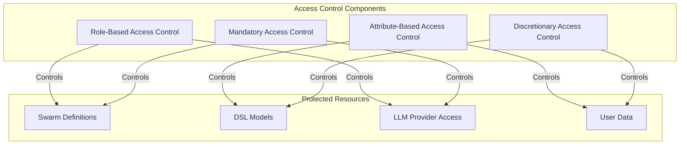
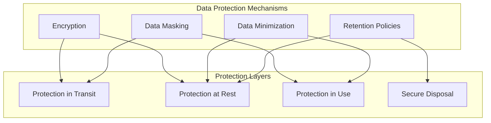
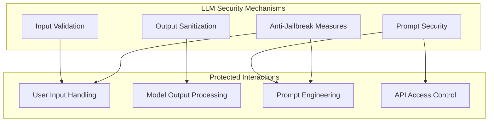
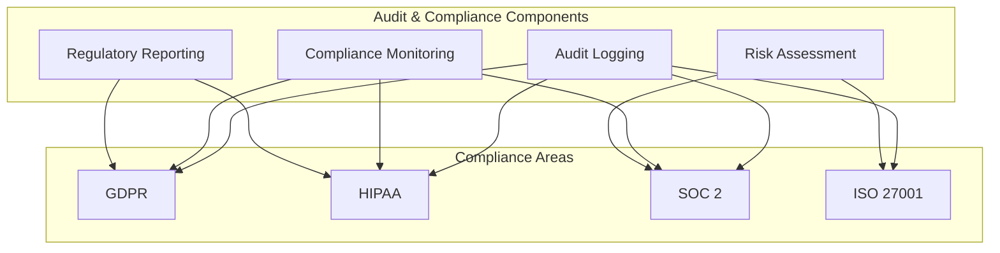
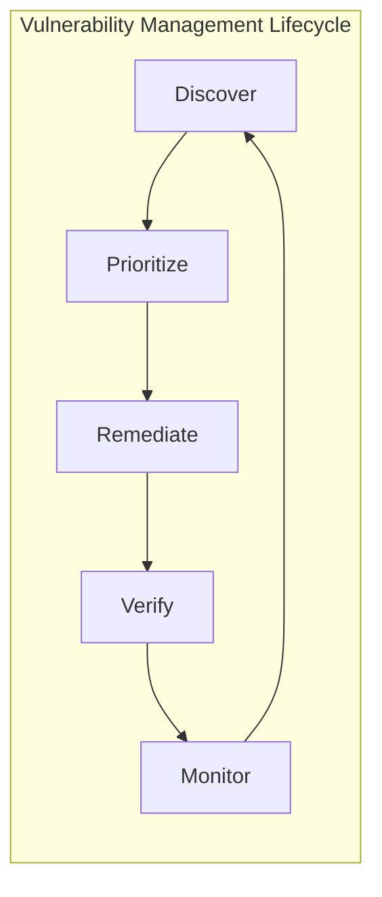
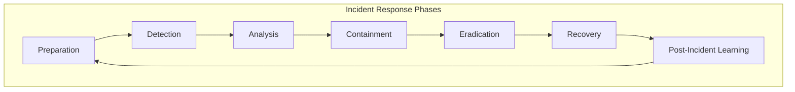
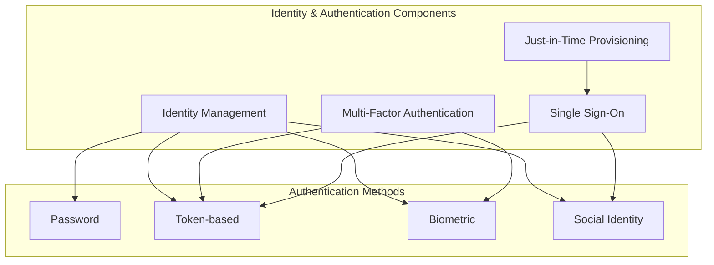
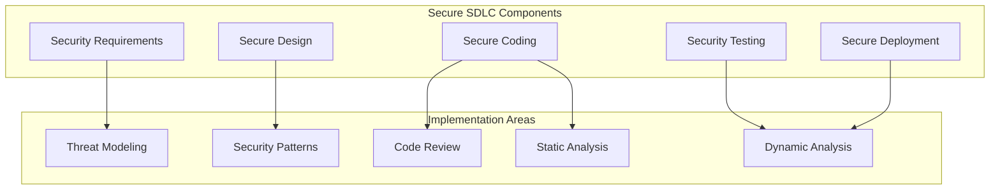

# Security & Compliance Features

This document outlines planned security and compliance features for AshSwarm, ensuring robust protection of data and adherence to regulatory requirements.

## Access Control System

AshSwarm will implement a comprehensive access control system to manage permissions across the platform.

### Implementation Plan

1. **Role-Based Access Control (RBAC)**
   - Define standard roles (admin, developer, operator, viewer)
   - Role inheritance and composition
   - Role assignment and management API
   - Context-aware role activation

2. **Attribute-Based Access Control (ABAC)**
   - Rule-based access control policies
   - Context-aware permission evaluation
   - Dynamic permission resolution
   - Policy management interface

3. **Permission Enforcement**
   - Centralized policy enforcement point
   - Audit logging of access decisions
   - Permission caching for performance
   - Denial feedback and remediation suggestions

4. **Admin Interface**
   - User and role management UI
   - Policy configuration interface
   - Access auditing dashboard
   - Permission testing tools

## Data Protection

AshSwarm will implement comprehensive data protection measures to safeguard sensitive information.

### Implementation Plan

1. **Data Encryption**
   - Transparent data encryption for database
   - End-to-end encryption for sensitive communications
   - Key management system
   - Encryption at field level for sensitive data

2. **Data Masking & Tokenization**
   - Automated PII detection and masking
   - Configurable masking rules
   - Tokenization for sensitive field values
   - Context-aware data exposure

3. **Data Minimization**
   - Configurable data retention periods
   - Automated data purging
   - Purpose-limited data collection
   - Data aggregation and anonymization

4. **Secure Data Management**
   - Data classification framework
   - Access controls based on classification
   - Data lineage tracking
   - Data provenance verification

## Secure LLM Integration

AshSwarm will implement security measures specific to LLM integration to prevent vulnerabilities and misuse.

### Implementation Plan

1. **Input Validation & Sanitization**
   - Content filtering for user inputs
   - Prompt injection detection
   - Malicious input pattern recognition
   - Rate limiting and throttling

2. **Output Filtering & Verification**
   - Content safety filtering
   - PII detection and redaction
   - Harmful content detection
   - Output verification against policies

3. **Prompt Security**
   - Secure prompt templates
   - Prompt versioning and approval workflow
   - Privilege separation in prompts
   - Least privilege principle for LLM capabilities

4. **Anti-Jailbreak Measures**
   - Detection of jailbreak attempts
   - Robust system prompt protection
   - Continuous monitoring of interactions
   - Adaptive defense mechanisms

## Audit & Compliance

AshSwarm will provide comprehensive audit capabilities and compliance features to meet regulatory requirements.

### Implementation Plan

1. **Comprehensive Audit Logging**
   - Immutable audit trail
   - User and system action logging
   - Detailed context capture
   - Searchable audit repository

2. **Compliance Monitoring**
   - Continuous compliance assessment
   - Policy adherence verification
   - Automated compliance checks
   - Violation alerting and remediation

3. **Risk Assessment Framework**
   - Automated risk scoring
   - Vulnerability management
   - Compliance gap analysis
   - Risk mitigation recommendations

4. **Compliance Reporting**
   - Customizable compliance reports
   - Evidence collection automation
   - Regulatory submission preparation
   - Compliance dashboard

## Vulnerability Management

AshSwarm will implement a systematic approach to identifying, assessing, and mitigating security vulnerabilities.

### Implementation Plan

1. **Vulnerability Scanning**
   - Automated code scanning
   - Dependency vulnerability checking
   - Runtime application protection
   - API security testing

2. **Security Testing Framework**
   - Penetration testing infrastructure
   - Fuzz testing capabilities
   - Security regression testing
   - LLM-specific security tests

3. **Patch Management**
   - Automated vulnerability notification
   - Dependency update automation
   - Hotfix deployment system
   - Rollback capabilities

4. **Threat Modeling**
   - System-wide threat assessment
   - Component-level threat modeling
   - Attack surface analysis
   - Risk prioritization framework

## Incident Response

AshSwarm will include a comprehensive incident response framework to address security incidents effectively.

### Implementation Plan

1. **Incident Detection**
   - Real-time security monitoring
   - Anomaly detection
   - Alert correlation
   - User-reported incident handling

2. **Response Automation**
   - Playbook-driven response
   - Automated containment actions
   - Evidence preservation
   - Stakeholder notification

3. **Forensic Capabilities**
   - Event reconstruction
   - Root cause analysis
   - Impact assessment
   - Evidence collection

4. **Recovery Planning**
   - System restoration procedures
   - Data recovery processes
   - Service continuity management
   - Post-incident verification

## Authentication & Identity

AshSwarm will implement robust authentication and identity management capabilities.

### Implementation Plan

1. **Flexible Authentication Options**
   - Password-based authentication with strong policies
   - Multi-factor authentication support
   - OAuth/OIDC integration
   - Biometric authentication options

2. **Identity Management**
   - User lifecycle management
   - Self-service account management
   - Directory service integration
   - Identity verification processes

3. **Session Management**
   - Secure session handling
   - Timeout and inactivity controls
   - Concurrent session limitations
   - Context-aware session validation

4. **Federation & SSO**
   - Enterprise identity provider integration
   - SAML support
   - Cross-domain authentication
   - Just-in-time provisioning

## Secure Development

AshSwarm will adopt secure development practices throughout its development lifecycle.

### Implementation Plan

1. **Secure Coding Practices**
   - Security coding standards
   - Automated security linting
   - Peer code review process
   - Security training program

2. **Security Testing Integration**
   - Automated security testing in CI/CD
   - Pre-commit security hooks
   - Static application security testing
   - Dynamic application security testing

3. **Dependency Management**
   - Automated dependency scanning
   - Approved package repository
   - Version pinning and locking
   - Dependency update automation

4. **Secure Configuration**
   - Configuration hardening guidelines
   - Environment-specific security settings
   - Secret management
   - Configuration validation 