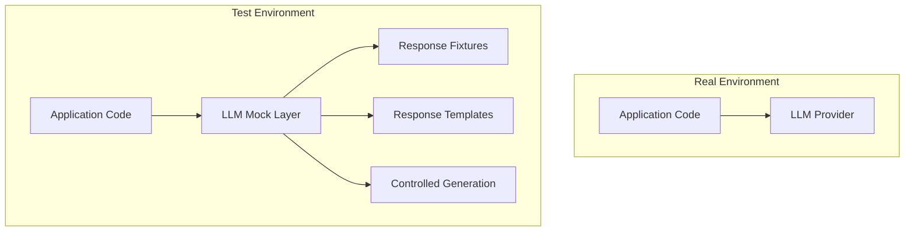
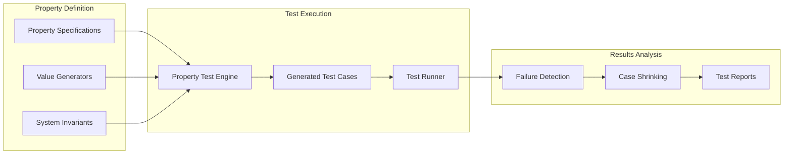
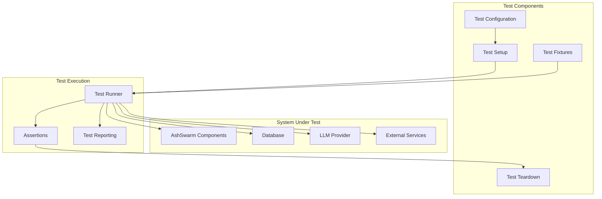
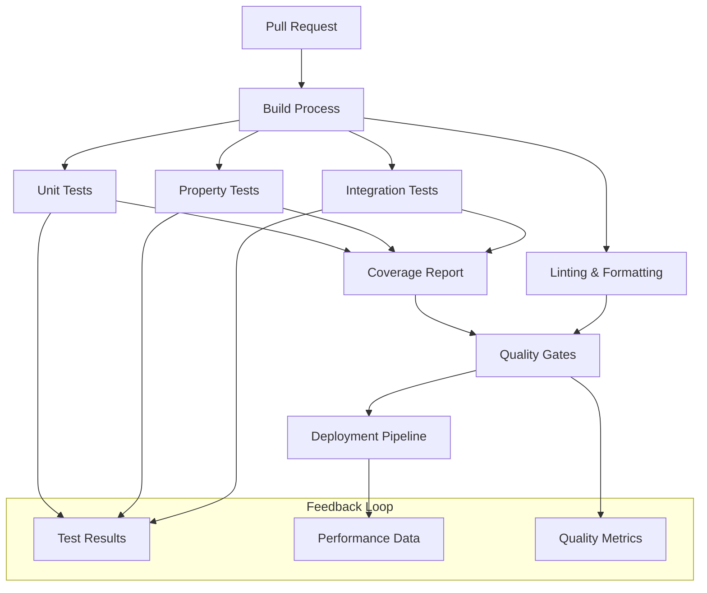
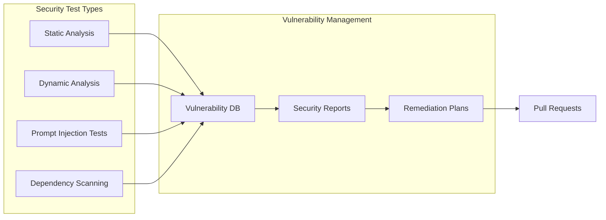
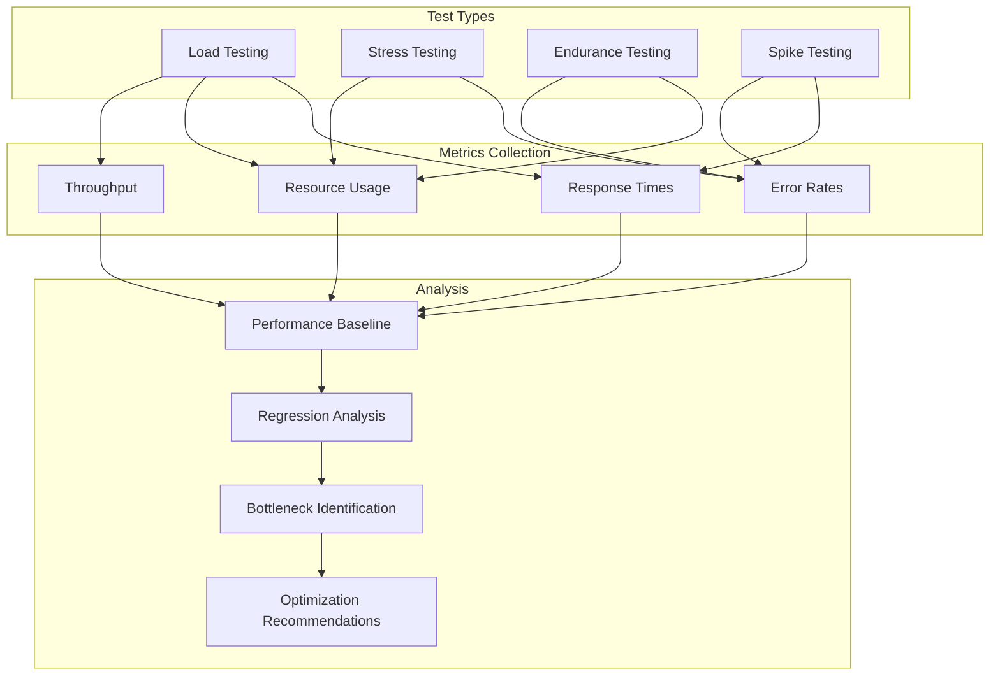
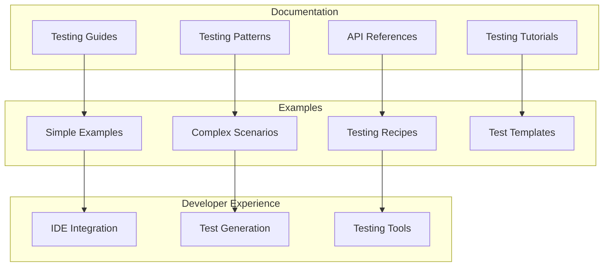

# Testing Infrastructure

This document outlines the planned enhancements to AshSwarm's testing infrastructure, providing more robust and comprehensive testing capabilities for all components.

## LLM Mocking Framework

### Overview

The LLM Mocking Framework will enable developers to test LLM-dependent code without making actual API calls, reducing costs and enabling deterministic testing.

### Implementation Plan

1. **Mock Interface**
   - Create drop-in replacement for InstructorHelper
   - Implement configurable response patterns
   - Support for simulated latency and rate limits
   - Add recording capability for test generation

2. **Response Fixtures**
   - Build library of common response patterns
   - Support for loading fixtures from files
   - Create versioned fixtures for testing model changes
   - Implement fixture generation from live API calls

3. **Templated Responses**
   - Create templating system for dynamic responses
   - Support variable substitution in templates
   - Enable conditional logic in response templates
   - Allow for randomized components with seeds

4. **Testing Utilities**
   - Response assertion helpers
   - LLM mock configuration DSL
   - Error scenario simulation
   - Parallel test execution management

## Property-Based Testing

### Overview

Property-based testing will allow for more robust validation of AshSwarm components by automatically generating test cases based on properties that should hold true.

### Implementation Plan

1. **Property Testing Framework**
   - Integration with StreamData and PropCheck
   - Custom generators for AshSwarm types
   - Shrinking strategies for complex data
   - Stateful property testing support

2. **Domain Model Generators**
   - Generate valid domain reasoning models
   - Create randomized but valid DSL structures
   - Generate compliant YAML/JSON for testing
   - Support for boundary cases and edge conditions

3. **Reactor Testing Properties**
   - Define common reactor invariants
   - Generate valid reactor inputs
   - Test reactors against state transition properties
   - Verify concurrency properties

4. **Property Test Utilities**
   - Property-based test macros
   - Test case persistence for regression testing
   - Visual representation of test cases
   - Performance benchmarking for property tests

## Integration Testing Framework

### Overview

The integration testing framework will enable comprehensive testing of interactions between AshSwarm components and external systems.

### Implementation Plan

1. **Test Environment Management**
   - Containerized test environments
   - Database state management
   - External service mocking
   - Environment variable isolation

2. **End-to-End Test Scenarios**
   - Define common user workflows
   - Create comprehensive test data
   - Support for API-driven test scenarios
   - LiveBook integration testing

3. **Test Fixture Management**
   - Standardized fixture formats
   - Fixture versioning and namespacing
   - Dynamic fixture generation
   - Fixture sharing across test suites

4. **Integration Test Utilities**
   - Integration test helpers
   - Custom assertions for AshSwarm components
   - Test timeouts and throttling
   - Distributed test execution

## CI/CD Integration

### Overview

Enhanced CI/CD integration will ensure that AshSwarm components are thoroughly tested before deployment and that tests are efficiently executed in the CI environment.

### Implementation Plan

1. **CI Pipeline Configuration**
   - GitHub Actions workflow configuration
   - Build matrix for multiple Elixir versions
   - OTP version compatibility testing
   - Fast feedback loops for common issues

2. **Test Segmentation**
   - Separate quick and slow test suites
   - Parallel test execution
   - Test suite prioritization
   - Incremental testing for branches

3. **Quality Gates**
   - Code coverage thresholds
   - Performance benchmarks
   - Documentation coverage
   - Static analysis integration

4. **Deployment Automation**
   - Automated release process
   - Blue/green deployment support
   - Canary releases
   - Rollback procedures

## Security Testing

### Overview

Security testing enhancements will ensure that AshSwarm is robust against common vulnerabilities and attacks, particularly those relevant to LLM-based systems.

### Implementation Plan

1. **Static Analysis**
   - Integrate security-focused static analyzers
   - Custom rules for LLM-specific vulnerabilities
   - Secrets scanning
   - Dependency vulnerability checking

2. **Prompt Injection Testing**
   - Test suite for prompt injection attacks
   - Validation of input sanitization
   - LLM behavior with malicious inputs
   - Defense-in-depth testing

3. **Penetration Testing Framework**
   - API security testing
   - Authentication and authorization tests
   - Rate limiting and throttling tests
   - Session management tests

4. **Security Test Reporting**
   - Security test dashboard
   - Vulnerability severity classification
   - Compliance reporting
   - Remediation tracking

## Performance Testing

### Overview

Performance testing infrastructure will enable systematic evaluation of AshSwarm's performance characteristics and identification of optimizations.

### Implementation Plan

1. **Load Testing Framework**
   - Configurable load profiles
   - Distributed load generation
   - Reactor-specific load tests
   - LLM call simulation

2. **Performance Metrics Collection**
   - Response time measurement
   - Resource utilization tracking
   - Throughput calculation
   - Concurrency measurement

3. **Benchmark Suite**
   - Standard performance benchmarks
   - Historical performance tracking
   - Comparative benchmarking
   - Microbenchmarks for critical operations

4. **Performance Test Reporting**
   - Performance dashboards
   - Trend analysis
   - Regression alerting
   - Optimization impact analysis

## Testing Documentation & Examples

### Overview

Comprehensive testing documentation and examples will make it easier for developers to create effective tests for AshSwarm components.

### Implementation Plan

1. **Testing Guides**
   - Unit testing guide for AshSwarm
   - Integration testing best practices
   - LLM testing strategies
   - Property-based testing introduction

2. **Example Test Suites**
   - Example tests for each component type
   - Test templates for common scenarios
   - Reference implementations
   - Test data examples

3. **Testing Tools**
   - Custom ExUnit assertions
   - Test generators
   - Test helpers for common operations
   - Visual test results

4. **Test Generation**
   - AI-assisted test generation
   - Property inference from code
   - Automatic fixture generation
   - Test coverage gap identification 